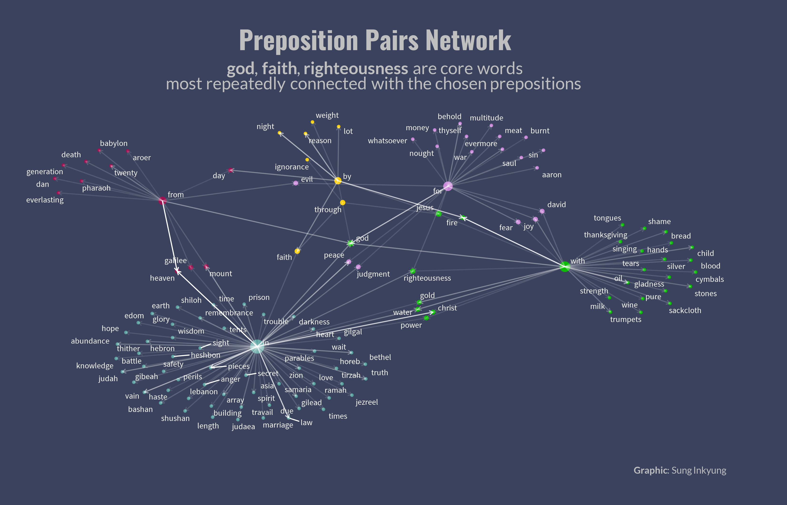

# Morning by Morning: WordSpice
a personal take on words in bible(KJV and NIV)

"The speech, the Word which establishes and binds together the fellowship, is accompanied by silence. ... We are silent **before** hearing the
Word because our thoughts are already directed to the Word, ... We are silent **after** hearing the Word because the Word is still speaking and dwelling within us"  
from _**Life Togehter**_  by Dietrich Bonhoeffer

-------------------------------------------------------------------------------------------------------------------------------------
## References(Book, Website, Youtube, Github)
|  Link  | Title | Author |
|--------|-------|--------|
|[:link:](https://korycapps.files.wordpress.com/2012/11/cs-lewis-on-the-psalms.pdf) | Reflections on the Psalms | C.S Lewis |
|[:link:](https://www.carus-verlag.com/en/choir/sacred-choral-music/mendelssohn-herr-gott-dich-loben-wir-church-music-ix.html) | Herr Gott, dich loben wir | Felix Mendelssohn Bartholdy |
|[:link:](https://static1.squarespace.com/static/518c65fee4b0887d9a39138d/t/5827e7aab3db2b0f3d311bf5/1479010229503/Life+Together_Eng.pdf) | Life Tegether | Dietrich Bonhoeffer |
|[:link:](https://https://youtu.be/7JGIDsfHqO8) | Humility | Andrew Murray |
|[:link:](https://youtu.be/ezbExj7pT1s) | Divine Conspiracy | Dallas Willard |
|[:link:](https://www.goodreads.com/book/show/44291053-maturity) | Maturity | Sinclair Ferguson |

--------------------------------------------------------------------------------------------------------------------------------------
### Sentiment Calendar

### Word Calendar

### Job ❤️‍🔥 David

### Job vs His Friends

### Distribution of FAITH, LOVE, HOPE

### Paul's Words

### Word Pairs of Ephesians

### 2021 Word Flower3

### 2021 Word Flower2

### 2021 Word Flower1

### Random Sample Words

### TF-IDF Net

### Word Canvas

### Ebbs and Flows

### WORDS 2020

### Seeds of Words

### Embedded Words in 2020

### Clothe Yourselves With

### Distribution of Body Parts 

### Prepositions Pairs Network

### Word PackCircles

### H O L Y

### Bible Books

### Ezekiel

### Ecclesiastes Chapter3

### Jeremiah Isaiah Ezekiel

### Words Parade

### Characters in Circles

### Words Parallel

### Characters in the Book of Job

### Chapters in Psalms

### Psalms Word Pillars

### Never Combo in Psalms

### Sentiment Web of 4 Gospels

### Psalms Sentiment Bisplines using NRC Lexicon

### Emotions in Psalms

### Psalms Using Afinn Sentiment Analysis

### Words in 4 Gospel Books

### Top Picks in Hebrews

### Books by Number of Characters

### WordBible Books by Word Frequency

